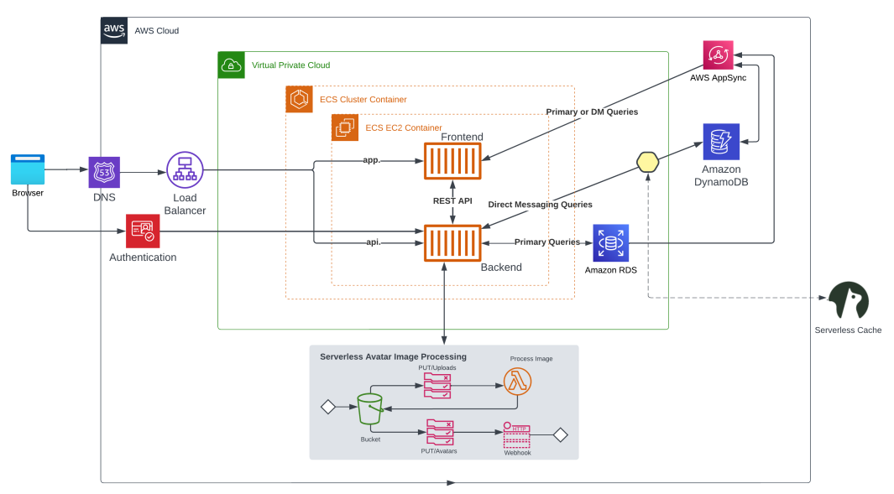
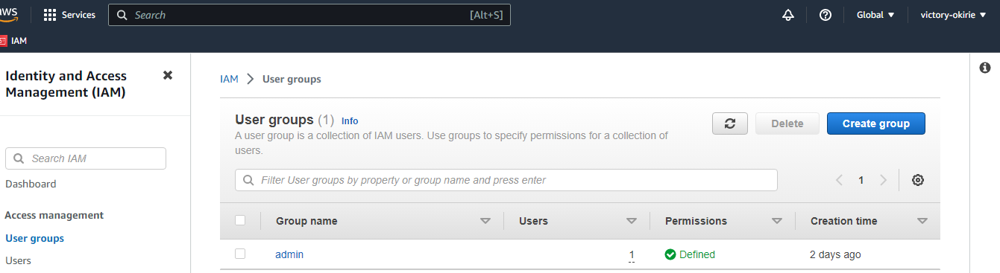
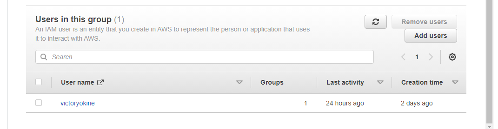
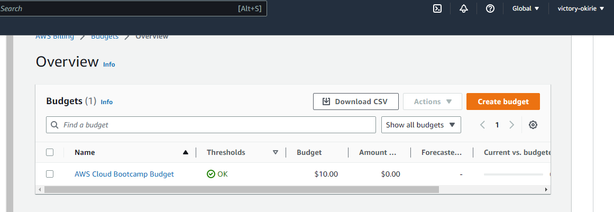

# Week 0 — Billing and Architecture

## Required Homework

### Recreate Logical Architectural Diagram in Lucid Charts
I was able to recreate a logical architectural diagram in Lucid Charts. A screenshot and link are provided below.

[Cruddur Logical Architectural Diagram](https://lucid.app/lucidchart/9d8ea97d-9fef-48f6-814d-0543af819bdc/edit?view_items=S~zx-PTK2ZRR&invitationId=inv_107741c9-980f-4541-bd60-eaccd90a6b72)

### Creating an Admin User
I created an admin user named victoryokirie

 

 

### Creating a Budget
I am created a budget for this bootcamp and I called it AWS Cloud Bootcamp Budget

